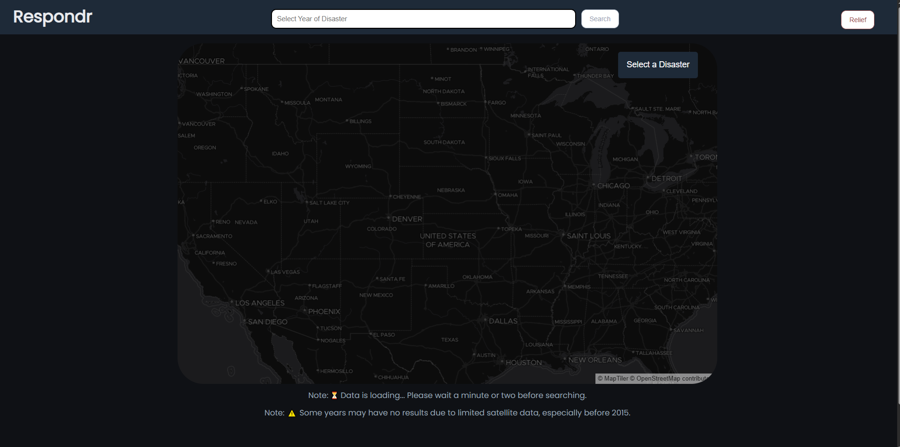
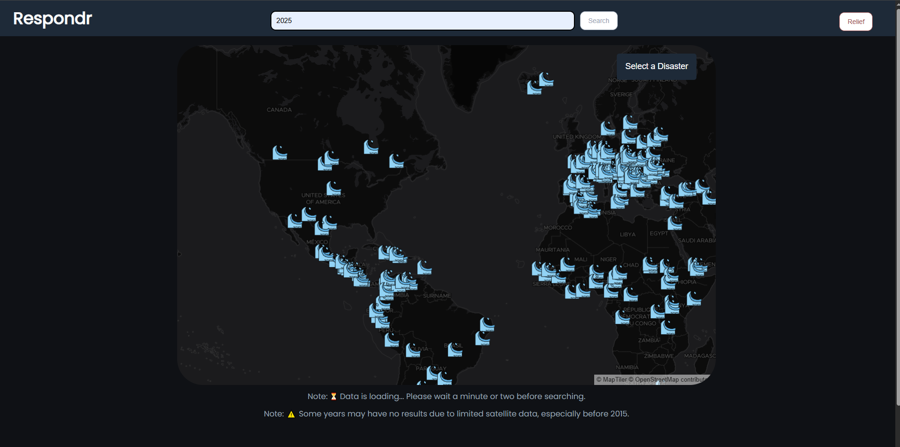

# Respondr - Natural Disaster Visualization

Respondr is an interactive web application that visualizes natural disasters on a map.
Designed for public awareness, research, and emergency preparedness,
it allows users to explore geospatial disaster data through a streamlined, responsive interface.

## Screenshots

### Main Interface


_Interactive map showing disaster events with filter options_

### Disaster Type Icons

      

_Custom disaster type markers used on the map_

### Example: Searching For Disasters in 2025


_Example showing flood events search results_

## Features

- 🗺️ **Interactive Map Visualization** - Real-time disaster event mapping
- 📅 **Year-based Search** - Filter events by specific years (1980-2025)
- 📱 **Responsive Design** - Optimized for desktop and mobile devices
- 🎯 **Custom Markers** - Unique icons for different disaster types:
  - 🔥 Wildfires
  - 🌋 Volcanoes
  - 🌊 Floods
  - ⛈️ Severe Storms
  - ❄️ Snow Events
  - 🧊 Sea and Lake Ice
  - 🏔️ Earthquakes
- 💡 **Clean UI** - Modern interface with intuitive navigation
- 📊 **Real-time Data** - Integration with NASA EONET API

## Technologies Used

- **Frontend**: HTML5, CSS3, JavaScript (ES6+)
- **Mapping**: MapLibre GL JS with MapTiler integration
- **Styling**: Google Fonts (Poppins), Custom CSS
- **Data Sources**: NASA EONET API for disaster events
- **Icons**: Custom emoji-based disaster markers

## Installation & Setup

1. Clone the repository:

   ```bash
   git clone https://github.com/yourusername/disaster-map.git
   cd disaster-map
   ```

2. Navigate to `http://localhost:8000` in your browser
3. Get API From `https://www.maptiler.com/`

## Usage

1. **View Disasters**: Click on any disaster type button to display markers on the map
2. **Filter by Year**: Enter a year (1980-2025) and click search to filter events
3. **Explore Details**: Hover over markers to see event details in popup windows
4. **Donate**: Use the donate button to support disaster relief efforts

## API Integration

The application uses the [NASA EONET API](https://eonet.gsfc.nasa.gov/docs/v3) to fetch real-time natural disaster data.

## Contributing

1. Fork the repository
2. Create a feature branch (`git checkout -b feature/amazing-feature`)
3. Commit your changes (`git commit -m 'Add amazing feature'`)
4. Push to the branch (`git push origin feature/amazing-feature`)
5. Open a Pull Request

## Acknowledgments

- NASA EONET team for providing the disaster data API
- MapTiler for map visualization services
